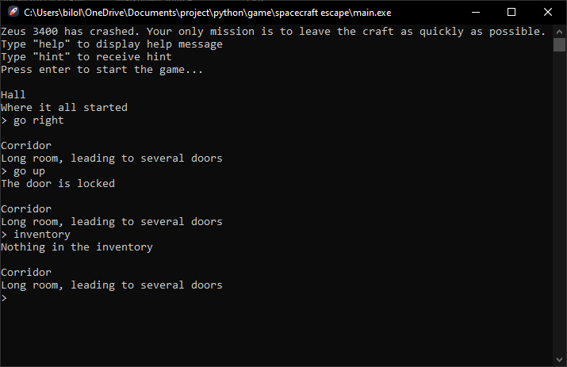

# Spacecraft escape

This is a part of my Computer Science A Levle course school project. The game was mainly created in python programming language v3.10.0.

You are in a spacecraft Zeus 3400. The craft has crashed. The main objective of the game is to leave the spacecraft as soon as possible. Use built-in command tools to navigate across the spaceship and pick up items.

### Commands availbable:
- go [up|east|south|west]
  - go to the room in specified direction
- take/pick
  - pick up every item in the room
- inventory
  - show every item in your inventory
- use [item]
  - use item in your inventory
- hint
  - receive a hint
- help
  - display a help message
- exit/quit
  - quit the game
  
### How to play:
1. Download the zipped version of the repository
2. Uncompress
3. Run main.py

#### Attention!
Use python version 3.10 or higher

### Alternatively way
1. Downlaod .exe file
2. Run .exe file (ignore all system warnings)

### Look and feel

### Enjoy!
